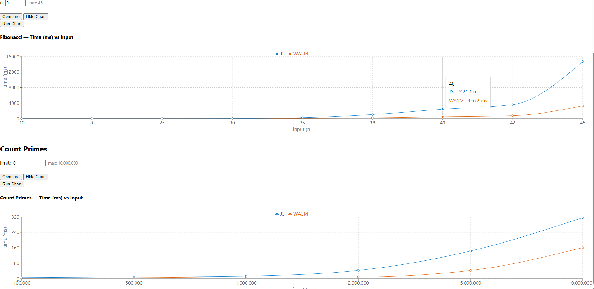

# react-wasm-demo

A personal learning project exploring **WebAssembly (WASM) via Emscripten** in a React + TypeScript app. It benchmarks C++ functions compiled to WASM against equivalent pure JavaScript implementations, measuring execution time and operation count side by side.



---

## Purpose

> _In a real browser environment, when does WebAssembly actually outperform JavaScript — and when does it not?_

| Algorithm                      | What it shows                                 |
| ------------------------------ | --------------------------------------------- |
| **Fibonacci (recursive)**      | JS JIT vs WASM on pure integer recursion      |
| **Prime Sieve (Eratosthenes)** | WASM vs JS on memory-intensive loops at scale |

---

## Prerequisites

| Tool               | Version            |
| ------------------ | ------------------ |
| Node.js            | 22.x               |
| npm                | 10.x               |
| Python             | 3.10 or above      |
| emsdk (Emscripten) | 5.0.7              |
| CMake              | 3.8.x              |
| Ninja              | any recent version |

### Install emsdk

```bash
git clone https://github.com/emscripten-core/emsdk.git
cd emsdk
./emsdk install 5.0.7
./emsdk activate 5.0.7
source ./emsdk_env.sh   # Linux/macOS
emsdk_env.bat           # Windows
```

### Install CMake

Download from https://cmake.org/download/ and add to PATH.

### Install Ninja

Download from https://github.com/ninja-build/ninja/releases and place on PATH.

---

## Getting Started

### 1. Clone

```bash
git clone https://github.com/<your-username>/react-wasm-demo.git
cd react-wasm-demo
```

### 2. Install JS dependencies

```bash
npm install
```

### 3. Compile C++ to WASM

```bash
cd embinding

# Step 1 — Configure (only needed once, or when CMakeLists.txt changes)
emcmake cmake . -G Ninja -DCMAKE_MAKE_PROGRAM="<your_ninja_path>\ninja.exe"

# Step 2 — Build (run this every time calc.cxx changes)
ninja
```

Output lands directly in `public/`:

```
public/
calc.js ← Emscripten glue code
calc.wasm ← compiled WASM binary
```

**When to re-run:**

| What changed             | Command needed                 |
| ------------------------ | ------------------------------ |
| `calc.cxx`               | `ninja` only                   |
| `CMakeLists.txt`         | `emcmake cmake .` then `ninja` |
| First time after cloning | both                           |

### 4. Start the app

```bash
cd ..
npm start
```

Open http://localhost:3000

---

## Project Structure

```
react-wasm-demo/
├── embinding/
│ ├── calc.cxx # C++ source: fibonacci + prime sieve
│ └── CMakeLists.txt # Emscripten build config
│
├── public/
│ ├── calc.js # Emscripten glue (generated — do not edit)
│ └── calc.wasm # WASM binary (generated — do not edit)
│
├── src/
│ ├── App.tsx # WASM initialization, top-level component
│ └── feature/
│ └── ComparisonBindingFunction/
│ ├── algorithm/ # pure JS implementations + op counters
│ ├── model/ # benchmark runner, chart data transformer
│ ├── view/ # React components (BenchmarkPanel, DisplayChart)
│ └── index.ts
│
├── package.json
└── README.md
```

---

## How It Works

```
embinding/calc.cxx
│ emcmake cmake . + ninja
▼
public/calc.js + calc.wasm
│ window.createModule()
▼
wasmModule (React state)
├── model/compareFunctions.ts → ComparisonResult
├── model/chartData.ts → ChartPoint[]
└── view/view.tsx → renders text + recharts chart
```

---

## Key Findings

- **Fibonacci**: JS is often faster than WASM — V8's JIT heavily optimizes simple integer recursion.
- **Prime Sieve**: WASM wins at `n >= 1,000,000`. Use `std::vector<char>` not `std::vector<bool>` — the latter bit-packs values and is slower.

---

## Dependencies

| Package    | Version | Purpose      |
| ---------- | ------- | ------------ |
| react      | 19.x    | UI framework |
| typescript | 5.x     | Type safety  |
| recharts   | 3.8.1   | Line chart   |

---

## Notes

- `performance.memory` is **Chrome only** — shows `N/A` in Firefox/Safari.
- Keep Fibonacci input below **45** — call count grows as `2^n` and will freeze the browser.
- `public/calc.js` and `public/calc.wasm` are build artifacts — consider adding to `.gitignore`.
